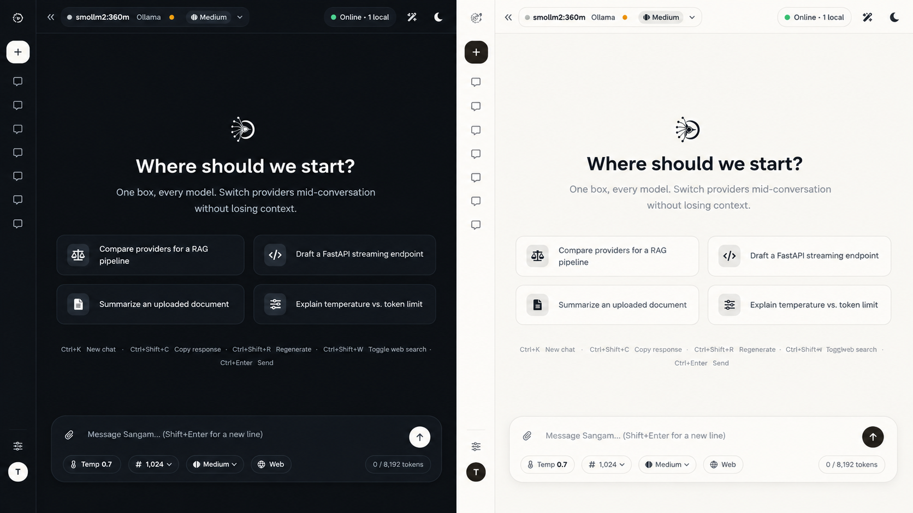

<div align="center">

<p align="center">
  
</p>

**One interface. Every model. Your workflow.**

A privacy-first AI workspace for chatting with cloud and local LLMs from a single modern interface.

[](https://www.python.org/)
[](https://fastapi.tiangolo.com/)
[](LICENSE)
[]()
[]()

</div>

---

## ✨ Meet Sangam

Sangam is an open-source, privacy-first AI chat platform that brings multiple Large Language Models into one unified workspace.

Connect cloud providers such as **OpenAI, Anthropic, Gemini, NVIDIA NIM, Groq, Mistral, DeepSeek, OpenRouter** and more — or run models locally through **Ollama**,**omniroute**.

Switch models, upload documents, use RAG, search the web, manage provider keys, and keep your conversations in one place.

> **Sangam v1.0 is under active development.** Features and APIs may evolve as the project grows.

---

## 🖥️ Interface

<p align="center">
  
</p>

<p align="center">
  <sub>One box, every model — switch providers without leaving your workspace.</sub>
</p>

---

## 🚀 Key Features

### 🤖 Multi-Provider AI

Connect multiple cloud and local AI providers from one interface and switch between models without changing applications.

### ⚡ Streaming Chat

Responses are streamed token-by-token for a fast and responsive conversational experience.

### 🦙 Local AI with Ollama

Use locally installed Ollama models directly inside Sangam while keeping inference on your machine.

### 📚 Document Chat + RAG

Upload documents and ask questions about their contents.

Sangam chunks documents, generates embeddings, retrieves relevant sections, and sends only the most useful context to the model.

### 🌐 Web Search

Augment conversations with live web results using the built-in search integration.

### 🧩 Skills

Reusable AI workflows for tasks such as debugging, API design, coding review, and web-assisted research.

### 💬 Persistent Conversations

Conversation history is stored locally and organized in a date-based sidebar.

### 🎨 Customizable Interface

A **Paper / Ink** design system — warm paper whites (PAPER) or deep charcoal (INK), with a restrained monochrome palette. Adjust font size, chat width, code theme, and animations from Settings.

### 🔐 Privacy Focused

Local authentication, encrypted provider keys, secure password hashing, and local conversation storage.

---

## 🤖 Supported AI Providers

| Provider | Type | API Key |
|---|:---:|:---:|
| Anthropic | ☁️ Cloud | Required |
| OpenAI | ☁️ Cloud | Required |
| NVIDIA NIM | ☁️ Cloud | Required |
| Together AI | ☁️ Cloud | Required |
| Groq | ☁️ Cloud | Required |
| OpenRouter | ☁️ Cloud | Required |
| DeepSeek | ☁️ Cloud | Required |
| Mistral AI | ☁️ Cloud | Required |
| Google Gemini | ☁️ Cloud | Required |
| Ollama | 🖥️ Local | Not required |
| OmniRoute | 🖥️ Local | Not required |

**NOTE - USE OMNIROUTE TO ACCESS ALL PROVIDERS**

The provider registry is extensible, making it possible to add additional providers as Sangam evolves.

---

## ⚡ Quick Start

### Requirements

Before starting, make sure you have:

- Python **3.11+**
- Git
- Ollama *(optional — only required for local models)*

### 1. Clone Sangam

```bash
git clone https://github.com/keshria-hacker/sangam.git
cd sangam
```

### 2. Configure Environment (manually optional)

Copy the example environment file:

```bash
cp .env.example .env
```

Add the API keys for the providers you want to use.

```env
OPENAI_API_KEY=your_key
ANTHROPIC_API_KEY=your_key
NVIDIA_NIM_API_KEY=your_key
GOOGLE_API_KEY=your_key
OPENROUTER_API_KEY=your_key
GROQ_API_KEY=your_key
```

You don't need to configure every provider.

API keys can also be managed later from:

**Settings → Provider API Keys**

### 3. Start Sangam

#### Windows

Simply run:

```bash
run.bat
```

Or:

```bash
python start.py
```

#### Linux / macOS

```bash
./start.sh
```

### 4. Open Sangam

Once the servers are running:

| Service | Address |
|---|---|
| Sangam | `http://127.0.0.1:5500` |
| Backend API | `http://127.0.0.1:8001` |
| Swagger API Docs | `http://127.0.0.1:8001/docs` |

---

## 🐳 Docker

Sangam can also run using Docker.

### Build

```bash
docker build -f Dockerfile.all -t sangam-all .
```

### Configure

```bash
cp .env.example .env
```

Add your required API keys to `.env`.

### Run

```bash
docker run -d \
  -p 8001:8001 \
  -p 5500:5500 \
  --env-file .env \
  sangam-all
```

### Docker Compose

```bash
docker compose -f docker-compose.all.yml up -d
```

---

## 🦙 Using Ollama

Sangam automatically detects available Ollama models.

Install or pull a model:

```bash
ollama pull llama3.2
```

Start Ollama:

```bash
ollama serve
```

Downloaded models will automatically appear inside the Sangam model selector.

To use another Ollama server:

```env
OLLAMA_BASE_URL=http://your-ollama-host:11434
```

> Ollama currently needs to be started manually.

---

## 📂 Document Support

Sangam can extract and work with multiple document and source-code formats.

| Format | Support |
|---|:---:|
| PDF | ✅ |
| DOCX | ✅ |
| XLSX | ✅ |
| PPTX | ✅ |
| CSV | ✅ |
| TXT / Markdown | ✅ |
| JSON | ✅ |
| HTML / XML | ✅ |
| Source Code | ✅ |

### RAG Pipeline

Large documents are automatically:

**Extracted → Chunked → Embedded → Retrieved → Added to Context**

Only the most relevant document sections are sent to the selected model, helping reduce unnecessary context usage.

---

## 🛠️ Tech Stack

| Layer | Technology |
|---|---|
| Backend | Python + FastAPI |
| Frontend | Vanilla JavaScript SPA |
| Database | SQLite + SQLAlchemy |
| LLM Integration | LiteLLM |
| RAG / Vector Search | ChromaDB |
| Authentication | Local Auth |
| API | REST + SSE Streaming |
| Deployment | Docker / Docker Compose |

---

## 🔐 Security & Privacy

Sangam is currently designed as a **local, single-user application**.

Security features include:

- 🔒 Provider API keys encrypted at rest
- 🔑 scrypt password hashing
- 🍪 HTTP-only authentication cookies
- 🛡️ CSRF protection
- 🚫 Debug mode disabled by default
- 💾 Local conversation storage

> **Important:** Sangam is not currently intended to be exposed directly to the public internet without additional production security configuration.

See [`SECURITY.md`](SECURITY.md) for security and vulnerability reporting information.

---

## 🧪 Testing

Run the test suite from the project root:

```bash
venv\Scripts\python.exe -m unittest discover -s tests -v
```

Tests cover core functionality including authentication, document processing, model discovery, streaming, Skills, and web search.

---

## 🤝 Contributing

Contributions, bug reports, feature requests, and improvements are welcome.

### Development Setup

```bash
git clone https://github.com/keshria-hacker/sangam.git
cd sangam
cp .env.example .env
python start.py
```

When contributing, please keep changes focused and follow the existing project structure and coding conventions.

---

## 📄 License

Sangam is released under the **MIT License**.

See [`LICENSE`](LICENSE) for details.

---

<div align="center">

### Sangam

**One interface. Every model. Your workflow.**

Built with ❤️ for the open-source AI community.

⭐ **If you find Sangam useful, consider giving the project a star.**

</div>
